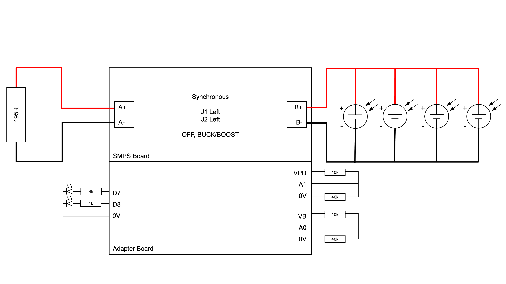
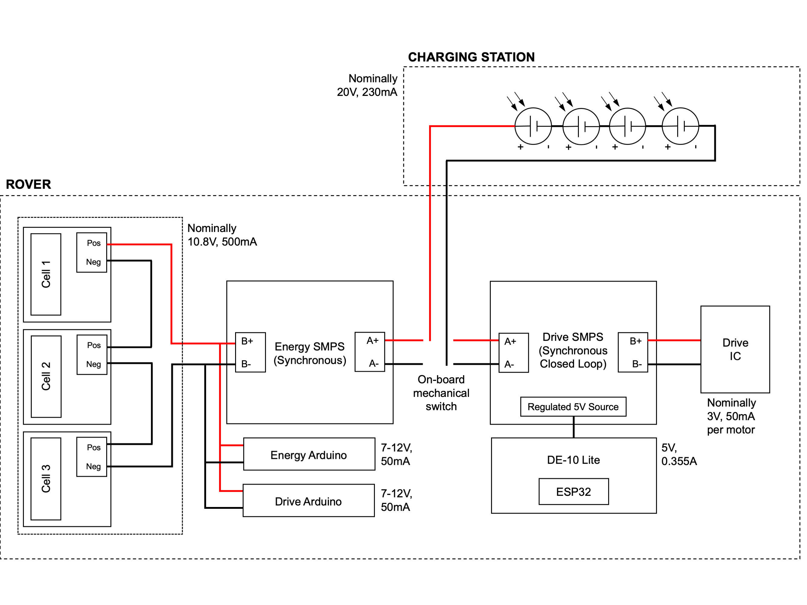

# Energy Subsystem

- [Energy Subsystem](#energy-subsystem)
- [1. Instructions](#1-instructions)
  - [1.1. Software Required](#11-software-required)
  - [1.2. Non-standard libraries from Arduino Library Manager](#12-non-standard-libraries-from-arduino-library-manager)
  - [1.3. Libraries for SMPS and interfacing with control](#13-libraries-for-smps-and-interfacing-with-control)
- [2. Run Files](#2-run-files)
  - [2.1. Demo for final video](#21-demo-for-final-video)
  - [2.2. Design implementation for interfacing with Control/ Command](#22-design-implementation-for-interfacing-with-control-command)
  - [2.3. Test Files](#23-test-files)
- [3. Other files](#3-other-files)
  - [3.1. Initial Battery Discharge Profiles](#31-initial-battery-discharge-profiles)
  - [3.2. Drive Power consumption](#32-drive-power-consumption)
- [4. Pseudocode for State Machine](#4-pseudocode-for-state-machine)
  - [4.1. Initialisation and Setup](#41-initialisation-and-setup)
  - [4.2. Main Loop](#42-main-loop)
  - [4.3. Main functions within the SMPS class](#43-main-functions-within-the-smps-class)


The aim of this README is to:

- Provide instructions for running the demo and test files,
- Outline the structure of this folder; and,
- Briefly outline the operation of the state machine through pseudocode.

# 1. Instructions

## 1.1. Software Required

To run the files, the following software has to be installed:
1. [Arduino IDE 1.8.15](https://www.arduino.cc/en/software)
2. [Python 3.X.X](https://www.python.org/downloads/)
3. [Mosquitto MQTT Broker v2.0.10](https://mosquitto.org/download/)

To setup a local MQTT broker, follow the instructions in "Setting up the MQTT broker and connections (if running local broker)" in the [command subsystem README](../Command_Subsystem/README.md). 

## 1.2. Non-standard libraries from Arduino Library Manager

There are several Arduino libraries that has been used, which are included at the the top of each `.ino` file.

```Arduino
#include <Wire.h>
#include <INA219_WE.h>
#include <SPI.h>
#include <SD.h>
#include <MovingAverage.h>
```

To run the files, install the following non-standard libraries:

- `INA219_WE` by Wolfgang Ewald, Version 1.1.6,
- `SD` by Arduino, SparkFun, Version 1.2.4,
- `Moving Average Library` by Alexandre Hiroyuki Yamauchi, Version 2.0.1

## 1.3. Libraries for SMPS and interfacing with control

The newest version of the SMPS library is available within the [Power](Power) folder. The newest version of the Control INterface library is available within the [Control](../Control_Subsystem/Arduino-ESP32%20Interface/arduino_code) folder.

To install both libraries with the Arduino Sketch, move the relevant `.cpp` and `.hpp` into the sketch folder and include these line at the top of the file:

```Arduino
#include "Power.h"
#include "ControlInterface.h"
```

# 2. Run Files

There are 4 sets of files (or types of files) that can be run, namely:

- Demo for final video,
- Design implementation for interfacing with Control,
- Design implementation for interfacing with Command; and,
- Other test files.

Since the batteries are not available for testing, only the demo file and some test scripts can be run.

## 2.1. Demo for final video

The demo file contains a simplified version of the master code. It can be accessed the [Mosquitto_Demo](Integration%20with%20Command/Mosquitto_Demo) folder. In general, it implements:

- A simulated error at the beginning of the file to be reset from command, to demonstrate that most errors are caused by sudden fluctuations
- Virtual discharging by looking up a pre-built csv files, with the range and run-time calculated; and
- Real-time charging by drawing power from the PV panels. In this implementation, a parallel configuration has been chosen to maximise the current drawn from the panels.

When testing the operation of the file on a local broker, comment the first line instead of the second one:

```Python
ip  = "35.177.181.61"
# ip = "localhost"
```

The circuit configuration is as follows:



To perform this demo:

1. Configure the SMPS board as shown in the circuit diagram above, and switch on the OL/CL switch to the left (CL),
2. Upload the [`.Mosquitto_Demo.ino`](Integration%20with%20Command/Mosquitto_Demo/Mosquitto_Demo.ino) file to the Arduino Nano Every board,
3. Initialise the AWS server or a local broker client via `/usr/local/sbin/mosquitto -c /usr/local/etc/mosquitto/mosquitto.conf -v`; and,
4. Run the [Python File](Integration%20with%20Command/Mosquitto_Demo/energy_mqqt_client_demowithPV.py).

The intended actions to be taken afterwards are:

1. Reset the initial error,
   - If using a local broker, run: 

    ```mosquitto_pub -t battery/command -m 2```

   - A message "Energy SMPS Reset!" should be seen in the terminal.
2. Send a drive status 1 (running) to  indicate that the rover is running and that the battery should be discharging; and,
    - If using a local broker, run
  
    ```mosquitto_pub -t rover/status -m {\"drive_status\":1}```
    
    - The terminal prints the drive status received.
3. Send a drive status 2 as soon as the rover arrives at the charging station, to indicate that it should start charging with the PV panels. (In practice, the return is triggered upon a low range estimate.)
   - If using a local broker, run 
  
    ```mosquitto_pub -t rover/status -m {\"drive_status\":2}```

   - The terminal prints the drive status received. In addition, the Arduino would print "Here comes the sun" and start printing the diagnostic current, voltage, PWM values into the terminal.

At anytime, to diagnose data sent to the local broker, the user can subscribe to designated topics, detailed in the Command Subsystem Appendix. For example, to subscribe to the status of the first cell, run:

```
mosquitto_sub -t battery/status/cell0
```

## 2.2. Design implementation for interfacing with Control/ Command

If the battery management system and charging station were to be implemented for the rover, the overall configuration would be as follows:



The implementation for integrating with command is included in the [Mosquitto Master](Integration%20with%20Command/Mosquitto_Master) folder, and the implementation for integrating with control is included in the [Energy_Control_Integration](Integration%20with%20Control/Energy_Control_Integration/) folder.

In general, the only difference between the 2 files is that:

- Data is communicated with control via the "Control Interface" library, which is a relatively efficient non-blocking protocol; whereas,
- Data is communicated with command via the Serial interface, which is less efficient, but also crucial for diagnostic purposes.

The pin assignments for the connections with battery relays, discharge circuit and measurement ports, are included in the beginning of the file:

```Arduino
#define PIN_OLCL 2
#define PIN_PWM 6
#define PIN_REDLED 7
#define PIN_YELLED 8
#define PIN_V1 A1
#define PIN_V2 A2
#define PIN_V3 A3
#define PIN_RLY1 5
#define PIN_RLY2 4
#define PIN_RLY3 9
#define PIN_VA A0
```

The Arduino file can be run upon including the relevant libraries, as mentioned in the "Installations" section. For the command integration file, the local broker can be set up procedure similar to "Demo for final video" video.

## 2.3. Test Files

All the other test files are included in the [Test Scripts](Test%20Scripts) folder. Similar to the previou files, the pin assignments are listed at top of the file. In addition, some test results are available as reference, alongside the relevant MATLAB plotting scripts.

Note that the correction factor for V_A (or V_PD labelled in some files) and V_B might have to be adjusted depending on the potential divider configured at the voltage measurement pins.

Brief description of the test files are written in [Tests.md](Tests.md)

# 3. Other files

## 3.1. Initial Battery Discharge Profiles

To characterised each cell at the beginning of the development, the voltage curves of each cell was obtained. The relevant plots are included in [Initial Battery Discharge Profiles](Initial%20Battery%20Discharge%20Profiles) and are generated with [SOC_battery1_static_SOH.m](Initial%20Battery%20Discharge%20Profiles/SOC_battery1_static_SOH.m).

## 3.2. Drive Power consumption

The [Drive_Data](Drive_Data) folder includes an excel file of the drive power data, as well as records of the power drawn from DE-10, ESP32, and the Arduino. These numbers are used to build a lookup table, to determine the discharge current. A plot of the speed against power is included as well, in the report.

# 4. Pseudocode for State Machine


## 4.1. Initialisation and Setup

```
Define pins
Initialise counters
    int_count (200Hz): triggered by TIMERA0's loop_trigger. reset every second.
    sec_count (1 Hz): reset every 3 minutes (voltage data collected every 3 mins during recalibration)
    rly_timer (200Hz): reset every 5 second (relays on battery boards triggered every 5 seconds)
    rest_timer (1 Hz): ensure that battery stays in CHARGE_REST/ DISCHARGE_REST for 30 secs.
    rapid_timer (1 Hz): ensure that battery does not stay in RAPID_CHARGE/ RAPID_DISCHARGE for more than 10 secs.
Initialise INA219 (current library sensor)
Initialise SMPS (library for processing SoC and SoH data)
Get SoH and cycle number - saved in SD card, loaded upon running mySMPS.init()

Print to serial: SOH_1, SOH_2, SOH_3, cycle1, cycle2, cycle3
```

## 4.2. Main Loop

``` C++

if (command received) {
    Decode command
    if (not in error and not in recalibration) {
        state = mySMPS.get_state()
        if (cmd == recalibrate) {
            Clear lookup tables (reset to zero.)
        }
    } else if (cmd == reset) {
        Reset to IDLE (reset can always be run, even during recalibration)
    } else {
        Ignore command sent during recalibration
    }
}

(every 5ms) {
    if (cell under-voltage or over-voltage) {
        state = ERROR
        Identify type of error for cell (no error, over-voltage, under-voltage)
    }

    Obtain current measurement

    if (charging) {
        Do not use PID controllers.
    } else if (cosntant voltage charging) {
        Use both outer loop voltage then inner loop current PID controller.
    } else {
        Use current PID controller.
    }
    Saturate PWM values within bound and write to SMPS

    int_count++, rly_timer++
}

(100 < rly_timer < 126) {
    Sequentially - for each cell switch on relay, measure voltage, then switch off relay
    (reset relay timer every 5 seconds)
}

// State Machine
(every sec) {
    switch (state) {
        case IDLE: {  // 0
            current_ref =  Get discharge current required during IDLE.
        }
        case CHARGE: { // 1
            Run MPPT Algorithm to select PWM.
            Balance Cells

            if (full: any one battery reached upper voltage limit) {
                state = CV_CHARGE
            }
        }
        case CHARGE_REST: { // 2
            if (not recalibrating) {
                state = IDLE
            }
            if (recalibrating) {
                Wait for 30 seconds.
                if (already fully discharged and charged) {
                    state = RECAL_Done // Recalibration is complete
                } else {
                    state = SLOW_DISCHARGE
                }
            }
        }
        case SLOW_DISCHARGE: { // 3
            current_ref = -250;
            Balance Cells
            if (empty: any one cell reached lower voltage limit) {
                state = DISCHARGE_REST
            }
        }
        case DISCHARGE_REST: { // 4
            if (not recalibrating) {
                state = IDLE
            }
            if (recalibrating) {
                Notify: discharge is completed.
                Wait for 30 seconds.
                Then send current capacity (counted using coulomb counting to SD file)
                state = CHARGE
            }
        }
        case ERROR: { // 5
            Set current_ref to 0 and do nothing.
        }
        case CV_CHARGE: { // 6
            vref = 3600
            if (current measure reaches 0) {
                state = CHARGE_REST
            }
        }
        case RECAL_DONE { // 7
            Notify: discharge completed
            Rebuild SoC lookup table (need to halt interrupts for this)

            Print to serial: SOH_1, SOH_2, SOH_3, cycle1, cycle2, cycle3
        }
        case DISCHARGE: { // 8
            current_ref =  Get discharge current required, depending on speed of drive
            Balance cells
            if (empty: any one cell reached lower voltage limit) {
                state = DISCHARGE_REST
            }
        }     
    }

    if (not recalibrating) {
        get SoC values
    }

    Print diagnostic values: state, V_1,2,3, current_ref,measure, SoC_1,2,3, discharge1,2,3 (for balancing)

    Estimate remaining range
    Estimate remaining runtime
    Get number of cycles if changed

    Print to serial: state, SoC_1,2,3, range, remaining runtime, error1,2,3
}

(every 3 min) {
    if (recalibrating) {
        Record V_1, V_2, V_3
    }
}

```

## 4.3. Main functions within the SMPS class

``` C++
void init(); 
```
Grabs the current capacity in terms of charge, charge and discharge curves, number of cycles from SD

``` C++
void decode_command(int cmd, int speed, int pos_x, int pos_y, int drive_status, float V_1, float V_2, float V_3);
```
Decodes the command. If rover is at charging hub (0,0),  then it sends a command to charge. By default, it tells the SMPS to stay in idle.  Whenever the drive status is running, it instructs the SMPS to discharge at an appropriate current.

``` C++
int estimate_range(int x0, int y0, float distance, int drive_status);
```
Algorithm does not return a value when the SoC drop is less than 20%. Beyond that the range is highly inaccurate and hence infinite for practical purposes. 
Assumes that the drop in range is linear to drop in SoC (which is clearly not true given that the motor's idle power is significant, and the ESP32 and DE10 draw a significant amount of power too. Therefore, remaining run time provides a better image of the remaining range of the rover)

``` C++
int estimate_time(float V_1, float V_2, float V_3);
```
Evaluates the remaining run time, by comparing the watt-hour capacity to the power drawn. The assumption is that the power drawn stays at approximately 2W (which is the IDLE power of the rover).

```C++
void determine_discharge_current(int speed, float V_1, float V_2, float V_3);
```
Having knowledge of the drive speed, it determines the discharge current, by looking up a speed-power table. The power value accounts for the power drawn from the ESP32 and DE10 as well (the power for the drive and energy arduino are accounted within the SMPS inefficiencies already). The current is then evaluated with I = Power/(V_1+V_2+V_3), and scaled by 1/0.9 to account for the SMPS inefficiencies.

```C++
void send_current_cap();
```
At the end of a discharge during recalibration, the class records the current capacity in terms of charge, obtained by coulomb counting during the discharge. The SoH values are evaluated as well and recorded on an SD.

```C++
void create_SoC_table();
```
At the end of recalibration, the class identifies the entries corresponding to a full discharge and a full charge. Since the intention is to make the SoC linear against the charge time (length of the full discharge and full charge voltage list), the SoC values are:
    - Mapped to 0-100% for the full charge voltage list
    - Mapped to 100% to 0% for the full discharge voltage list
These mappings are effectively the lookup tables used in the future. The assumption here is that the cells are perfectly balanced during recalibration.

```C++
void charge_discharge(float current_measure);
void charge_balance(float V_1, float V_2, float V_3, float current_measure);
void discharge_balance(float V_1, float V_2, float V_3, float current_measure);
```
The rationale of balancing is to decrease the current through higher SoC cells during charging, and through lower SoC cells during discharging. This method turns on and off the discharge pin based on this rationale. It also accounts for the difference in current through the cells when the discharge circuit is connected, to provide a more accurate coulomb counting value.
If the relays are on during this period, the reduction in charge flowing is accounted for as well.

```C++
void compute_SOC(int state_num, float V_1, float V_2, float V_3);
```
This is the most important function. In general, an upper and lower voltage threshold is defined for discharging and charging. The rationale is:
- Below and above these thresholds, the SoC is obtained by looking up the charge/ discharge table. A moving average filter of size 120 is also applied.
- Within these thresholds, the SoC is obtained by coulomb counting. Moving average is not adopted here, since the difference in measurements between time instances are too small.


```C++
void next_cycle();
```
The class keep tracks of the coulomb count of each cell. Upon reaching the cell charge capacity, the cycle value is incremented by 0.5 (a full cycle involves a full charge and full discharge).

