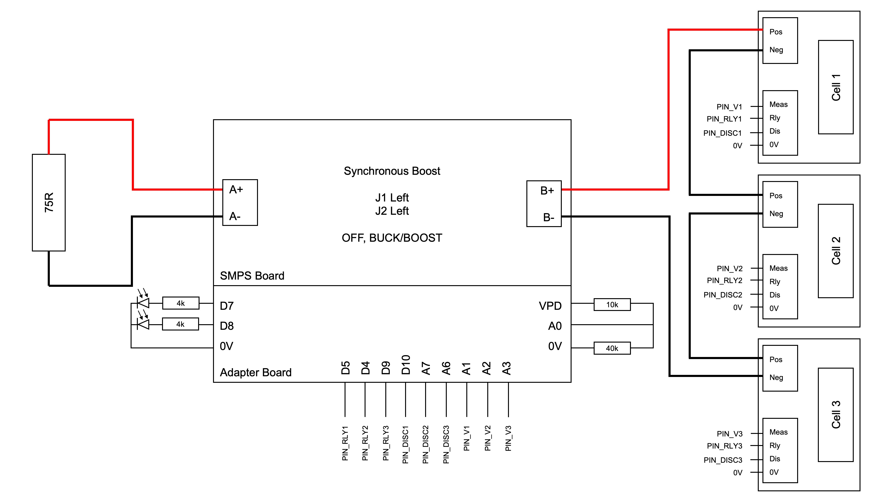
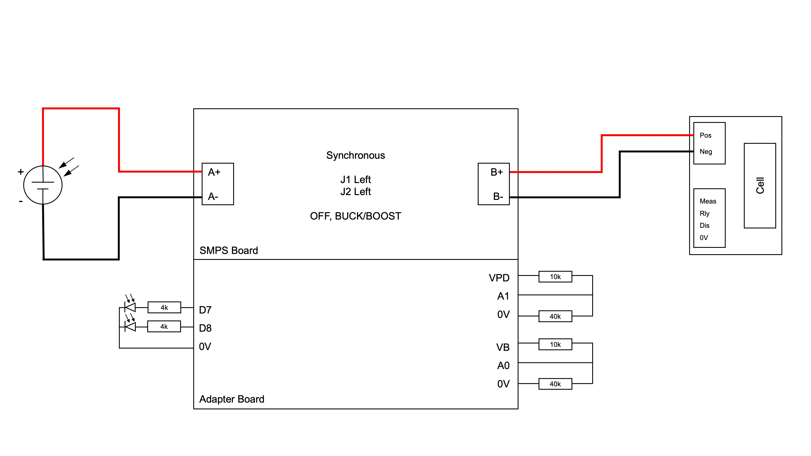
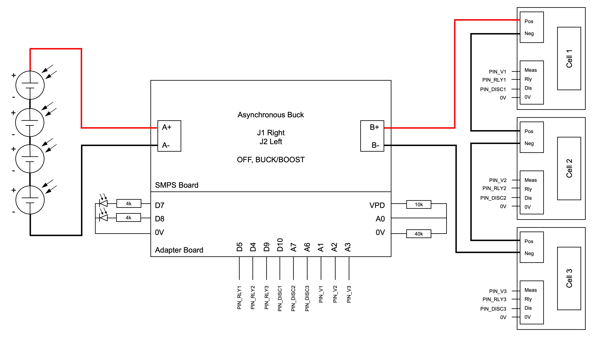

# 1. Energy HQ

This file is a supplement for the energy subsystem report material.

## 1.1. Table of Contents

- [1. Energy HQ](#1-energy-hq)
  - [1.1. Table of Contents](#11-table-of-contents)
  - [1.2. Requirements](#12-requirements)
    - [1.2.1. Aim for demo](#121-aim-for-demo)
    - [1.2.2. Aim for codebase](#122-aim-for-codebase)
  - [1.3. Tests](#13-tests)
    - [1.3.1. 1 Charging and discharging one cell](#131-1-charging-and-discharging-one-cell)
    - [1.3.2. 2 Discharging series cells](#132-2-discharging-series-cells)
    - [1.3.3. 3 Charging series cells](#133-3-charging-series-cells)
    - [1.3.4. 4 Characterising one PV panel](#134-4-characterising-one-pv-panel)
    - [1.3.5. 5 Characterising the charging of one cell with one PV panel](#135-5-characterising-the-charging-of-one-cell-with-one-pv-panel)
    - [1.3.6. 6 Series charging of multiple cells with series PV panels](#136-6-series-charging-of-multiple-cells-with-series-pv-panels)

## 1.2. Requirements

The energy subsystem will provide the rover with charged batteries using solar panels. The main tasks for this subsystem are:

1. Charge batteries.
2. Battery charge profile design.
3. Battery charge status estimation. Time till completion?
4. Battery balancing algorithm.
5. PV MMPT algorithm.
6. System Integration and Test.
7. Rover range estimation.
8. Prevent explosion/melt.

### 1.2.1. Aim for demo

We do not need to implement the hardware for the batteries and PV charging since the hardware isn't there for integration. For the final video, since the batteries cannot be used, a demo file has been used, which publishes the SoC values of the pack previously obtained from a discharge test. These values, alongside the state machine state and range, are published real time to the MQTT server.

### 1.2.2. Aim for codebase

For the control/command side, this means the Arduino Nano Every for drive and energy will need to receive:

- Anything required by the drive submodule
- Distance travelled (from drive)
- Drive status (FREE, MOVING, AT HUB)
- Instructions that will be run:
  - Recalibrate the battery (command 1)
    - Estimate the state of health SoH of battery
    - Discharges and charges the entire battery, taking around 4 hours in total, (assuming the solar panel can charge as fast as a wall charger)
  - Reset the battery (command 2)
    - Useful when the SoC values greatly deviate from expected. This is a common problem during startup, since the first SoC value is obtained from lookup; however, the OCV varies very little across the middle SoC range.
    - A reset is also necessary when the OCV measurements are beyond the upper and lower thresholds
  - Discharge the battery
    - Automatically triggered upon drive status 1 (MOVING)
    - Note that the battery also discharges during IDLE, when the drive status is 0 (FREE), because the the motors drive power even when the speed is zero.
  - Charge the battery
    - Automatically triggered upon drive status 2 (AT CHARGING HUB), or when the drive coordinates are (0,0)
    - Will trigger the MPPT P&O algorithm and charge the battery pack using the solar cells.

Similarly, the arduino will send:

- Range estimation information
- State of charge information
  - And also time till completion
- Status of battery: 
  - The battery charges with respect to a state machine structure, namely:
    - 0 IDLE
    - 1 CHARGE (yellow LED)
    - 2 CHARGE REST (note: only records charge data after first discharge)
    - 3 SLOW DISCHARGE (250mA)
    - 4 DISCHARGE REST
    - 5 ERROR (red LED)(must go to 0 next and restart)
    - 6 CONSTANT VOLTAGE CHARGE (blinking yellow LED)
    - 7 RECALIBRATION COMPLETE
    - 8 NORMAL DISCHARGE (Nominally 500mA)
    - 9 RAPID DISCHARGE (1A) - deprecated
    - 10 RAPID CURRENT CHARGE (500mA) - deprecated
  - The status of the battery is important. For example, in a real setup, when the battery is in an error state, it will stop delivering power to other modules and the motor. Most of the time however, it can simply be resolved by resetting the state machine to 0, and then entering charge or discharge mode.
  - We might make decisions depending on the last state of the battery. The states experienced by the batteries are as follows:
    - recalibrate: 0 > 1 > 6 > 2 > 3 > 4 > 1 > 6 > 2 > 7 > 0
    - discharge: 0 > 8 > 4 > 0
    - rapid_discharge: 0 > 9 > 8 > 4 > 0
    - charge: 0 > 1 > 6 > 2 > 0
    - rapid_charge: 0 > 10 > 1 > 6 > 2 > 0

## 1.3. Tests

The main tests conducted prior to implementation include

1. Charging and discharging one cell, to obtain the characteristic charge and discharge curves, as well as to test recalibration
2. Discharging series cells 
3. Charging series cells
4. Characterising one PV panel
5. Characterising the charging of one cell with one PV panel
6. Series charging of multiple cells with series PV panels

### 1.3.1. 1 Charging and discharging one cell

This original charge/discharge cycle has been performed with all cells, with the results stored within the 'Initial Battery Discharge Profiles" folder. The relevant graphs, including the voltage, current measured and SoC can be plotted using `SOC_battery1_static_SOH.m`.

Note that at this point, the SoC is calculated after the tests, using MATLAB.

Finally, this test has been modified to include constant voltage charging. The implications of these results are well explained within the report.

### 1.3.2. 2 Discharging series cells

At this point, the SoC estimation is on the Arduino.

The main aim of this test is to test cel balancing during discharging. This test involves discharging the cells at a constant 250mA current. An ideal SoC curve should appear something like this:

  

    
  

In practice however, the curve looks like this:

This means that the SoC estimation is not very accurate, which spoils the cell balancing algorithm. Regardless of the relatively inaccurate SoC estimation, the cell balancing was rarely adopted during discharging. This suggests that a more aggressive cell balancing algorithm (say balancing when the SoC difference is merely 1%) would do little benefit to the state of health of the battery pack.

   

Despite the fact that moving average is only used during OCV measurement (and not coulomb counting), the coulomb counting slope is too flat. There are several corrections that could be combined to provide a better SoC:

1. Apply a correctional factor of 1.5 to 2 to coulomb counting, such that the slope is steeper, which will likely mitigate the issue of the current measurement being consistently underestimated
2. Raise the upper voltage threshold for OCV (start coulomb counting earlier). This is because the SoC estimation has approached the point where the change in OCV is small compared to change in SoC, so the OCV methods consistently over-estimates the SoC
3. Raise the lower voltage threshold for OCV (end coulomb counting earlier). This is to ensure a smoother transition towards a fully discharged state, aided by a moving average filter applied during OCV measurement.
4. Increase the size of the moving average filter, such that the size is around 5 minutes. The one implemented only evaluates averages from the past 10 seconds.

### 1.3.3. 3 Charging series cells

The main aim of this test is to test cell balancing during charging. This test was only attempted once. Similar to the discharging test, the charging was achieved, but the on-device SoC estimation was unsuccessful.

### 1.3.4. 4 Characterising one PV panel

The main findings of this test are already outlined in the report.

### 1.3.5. 5 Characterising the charging of one cell with one PV panel

The main findings of this test are already outlined in the report.

### 1.3.6. 6 Series charging of multiple cells with series PV panels

This test was not attempted.
