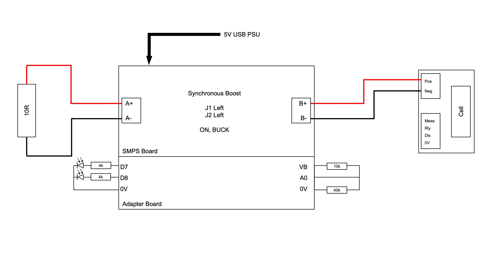
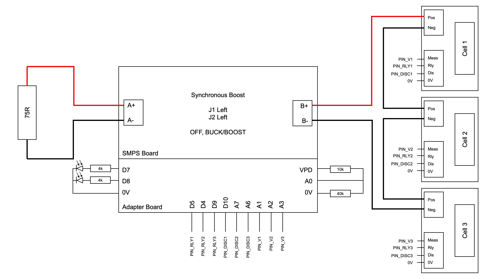
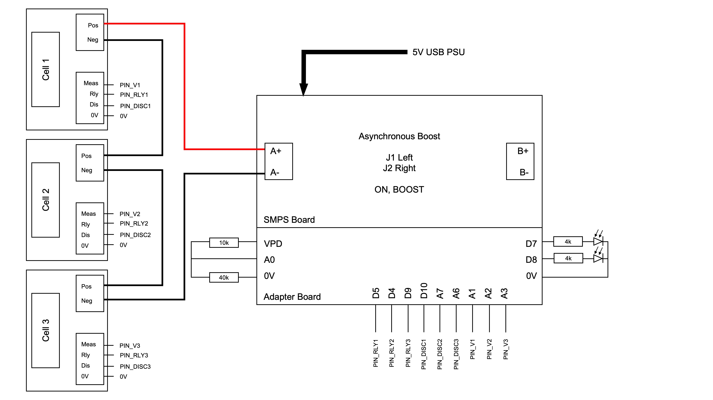
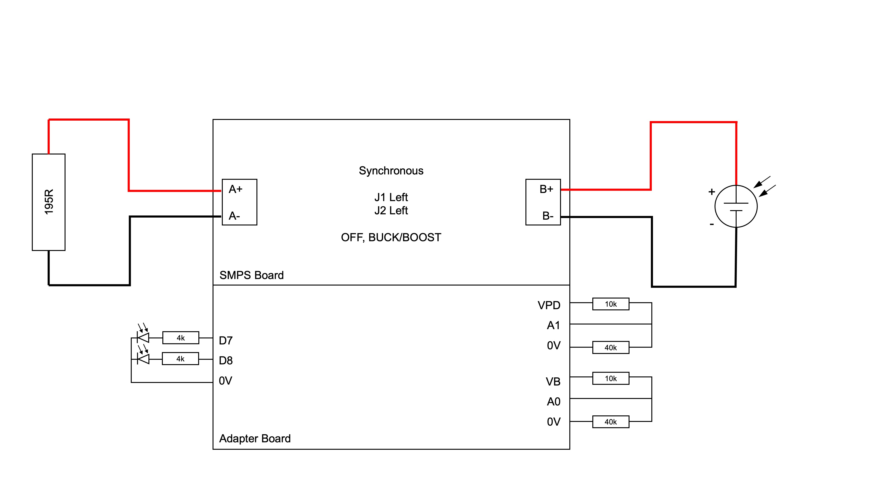
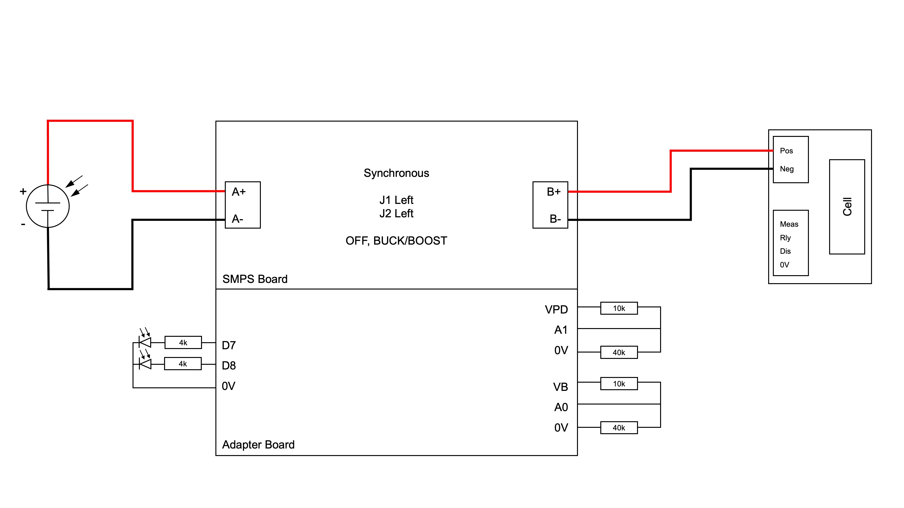
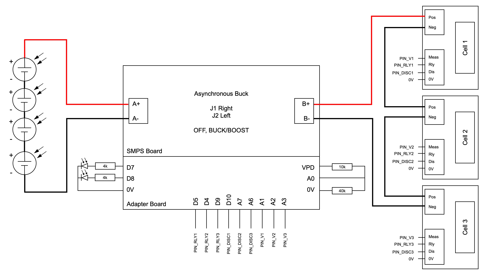

# Tests Performed

Table of Contents
- [Tests Performed](#tests-performed)
- [1. Instructions](#1-instructions)
- [2. Tests](#2-tests)
  - [2.1. Charging and discharging one cell](#21-charging-and-discharging-one-cell)
  - [2.2. Discharging series cells](#22-discharging-series-cells)
  - [2.3. Charging series cells](#23-charging-series-cells)
  - [2.4. Characterising one PV panel](#24-characterising-one-pv-panel)
  - [2.5. Characterising the charging of one cell with one PV panel](#25-characterising-the-charging-of-one-cell-with-one-pv-panel)
  - [2.6. Characterising the charging of 3s1p battery pack with series PV panels](#26-characterising-the-charging-of-3s1p-battery-pack-with-series-pv-panels)
  - [2.7. Recalibration](#27-recalibration)

The main tests conducted prior to implementation are included in the Test Scripts folder. This includes:

1. `Single_Cell_SoC_OOP`: Charging and discharging one cell, to obtain the characteristic charge and discharge curves, as well as to test recalibration
2. `Wall_Discharge`: Discharging series cells 
3. `Wall_Charge`: Charging series cells
4. `PnO_Sweep_Duty` and `PV_PnO_resistors`: Characterising one PV panel
5. `Single_Cell_PV_Panel_Charge` and `PnO_1PV_1Cell`: Characterising the charging of one cell with one PV panel
6. `SeriesCell_SeriesPV_Panel_Charge`: Series charging of multiple cells with series PV panels (not performed)

Miscellaneous:

7. `Recalibrate_SoC_SingleCell` and `Recalibrate_SoC_Last_Step`

# 1. Instructions

1. Pin assignments are defined at the top of each `.ino` file.
2. Run the file using the SMPS libraries included in the sketch folders. They are simplified versions of the SMPS class.

# 2. Tests

## 2.1. Charging and discharging one cell

Relevant sketch: [`Single_Cell_SoC_OOP`](Test%20Scripts/Single_Cell_SoC_OOP)

Th purpose of this test is to obtain the original charge/discharge cycle for all cells.

The results are stored within the 'Initial Battery Discharge Profiles" folder. The relevant graphs, including the voltage, current measured and SoC can be plotted using `SOC_battery1_static_SOH.m`. At this point, the SoC is calculated after the tests, using MATLAB.

This test has also been modified to include constant voltage charging. The implications of these results are well explained within the report.

## 2.2. Discharging series cells

Relevant sketch: [`Wall_Discharge`](Test%20Scripts/Wall_Discharge)

At this point, the SoC estimation is on the Arduino.

The main aim of this test is to test cell balancing during discharging. This test involves discharging the cells at a constant 250mA current. 

Despite the fact that moving average is only used during OCV measurement (and not coulomb counting), the coulomb counting slope is too flat. There are several corrections that could be combined to provide a better SoC:

1. Apply a correctional factor of 1.5 to 2 to coulomb counting, such that the slope is steeper, which will likely mitigate the issue of the current measurement being consistently underestimated
2. Raise the upper voltage threshold for OCV (start coulomb counting earlier). This is because the SoC estimation has approached the point where the change in OCV is small compared to change in SoC, so the OCV methods consistently over-estimates the SoC
3. Raise the lower voltage threshold for OCV (end coulomb counting earlier). This is to ensure a smoother transition towards a fully discharged state, aided by a moving average filter applied during OCV measurement.
4. Increase the size of the moving average filter, such that the size is around 5 minutes. The one implemented only evaluates averages from the past 10 seconds.

## 2.3. Charging series cells

Relevant Sketch: [`Wall_Charge`](Test%20Scripts/Wall_Charge)

The main aim of this test is to test cell balancing during charging, similar to the previous test. This test was only attempted once. Similar to the discharging test, the charging was achieved, but the on-device SoC estimation was unsuccessful.

## 2.4. Characterising one PV panel

Relevant sketches: [`PnO_Sweep_Duty`](Test%20Scripts/PnO_Sweep_Duty) and [`PV_PnO_resistors`](Test%20Scripts/PV_PnO_Resistors)

The 2 sketches utilise the same circuit configuration. The former sweeps the duty cycle to obtain the power and current against voltage plots, whereas the later utilises the P&O algorithm to charge the resistor. The results for this test are detailed in the report.

## 2.5. Characterising the charging of one cell with one PV panel

Relevant sketches: [`Single_Cell_PV_Panel_Charge`](Test%20Scripts/Single_Cell_PV_Panel_Charge) and [`PnO_1PV_1Cell`](Test%20Scripts/PnO_1PV_1Cell)

The 2 sketches utilise the same circuit configuration. Similar to the previous 2 sketches, the former sweeps the duty cycle to obtain the power and current against voltage plots, whereas the later utilises the P&O algorithm to charge the cell.

## 2.6. Characterising the charging of 3s1p battery pack with series PV panels

Relevant sketch: [`SeriesCell_SeriesPV_Panel_Charge`](Test%20Scripts/SeriesCell_SeriesPV_Panel_Charge)

This test was not attempted.

## 2.7. Recalibration

Relevant sketches: [`Recalibrate_SoC_SingleCell`](Test%20Scripts/Recalibrate_SoC_SingleCell) and [`Recalibrate_SoC_Last_Step`](Test%20Scripts/Recalibrate_SoC_Last_Step)

`Recalibrate_SoC_SingleCell` test is a slightly rebuilt version of `Single_Cell_SoC_OOP`, but tasked with identifying the start and ends of the discharge and charge cycle. 

`Recalibrate_SoC_Last_Step` requires no hardware connected. It tests the feasability of halting the interrupt within the state machine, so as to process the entire charge/discharge cycle and to compute the relevant SoC.
